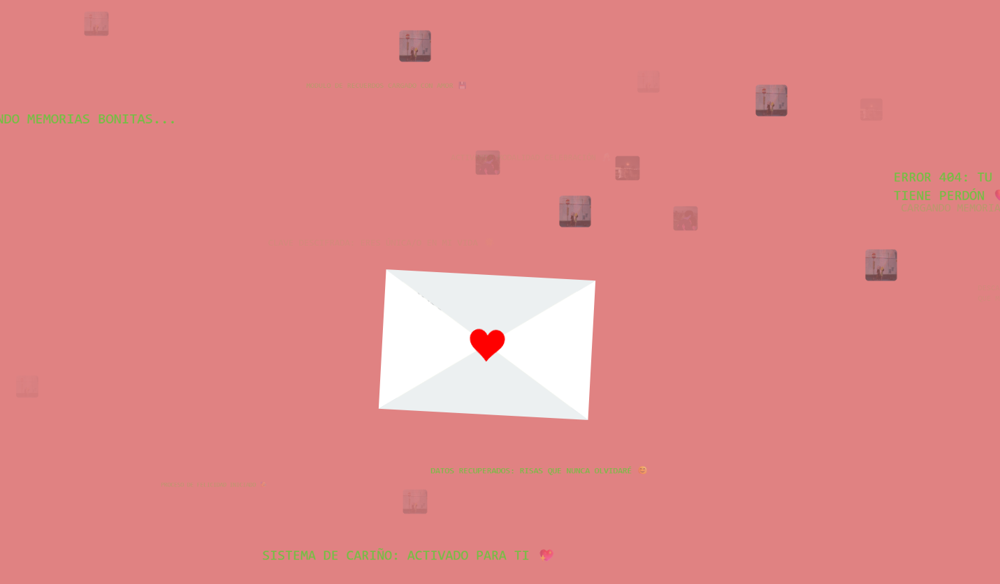

# 🎉 Proyecto: Carta Interactiva de Cumpleaños + Pastel Animado 🎂

## 📜 Descripción

Este proyecto es una experiencia interactiva y personalizada para desear un **feliz cumpleaños** de una manera única y original. Al cargar la página, se activa un **efecto visual tipo hackeo** con mensajes e imágenes divertidas. Después de 10 segundos, se habilita una carta animada con un mensaje principal. Tras 4 segundos, aparece una **segunda carta más pequeña**, con una dedicatoria especial al centro de la pantalla.

Finalmente, el usuario también puede ver un hermoso **pastel animado con velitas encendidas**, que complementa la celebración con un diseño visual cálido y festivo.

> 💡 Ideal para sorprender a alguien especial en su cumpleaños o para practicar animaciones, interactividad y manipulación del DOM con JavaScript, jQuery y CSS.

## 🛠️ Tecnologías usadas

- HTML5
- CSS3 (animaciones, estilos modernos)
- JavaScript (puro y con jQuery)
- SVG (para efectos vectoriales y pastel)
- Librería `canvas-confetti` para confeti personalizado

## 📁 Estructura de Archivos

```
📁 proyecto-cumple/
├── index.html
├── styles.css
├── carta.js
├── pastel.html
├── pastel.css
├── /img
│   ├── lucia.jpg
│   ├── pepe.jpg
│   └── gola.jpg
└── /audio
    └── musica.mp3
```

## 🎬 Características Principales

### ✉️ Carta de cumpleaños con efecto hackeo
- Mensajes aleatorios en pantalla con tipografía tipo consola
- Imágenes aleatorias flotando (estilo "memorias")
- Música que se activa con clic del usuario
- Carta principal que se abre tras 10 segundos

### ❤️ Carta secundaria
- Aparece automáticamente 4 segundos después de abrir la carta principal
- Contiene una dedicatoria emocional personalizada
- Estilizada con bordes, sombras, y colores suaves

### 🎂 Pastel animado
- Pastel de cumpleaños con velas encendidas y movimiento
- Código HTML + CSS + animaciones que simulan fuego en las velas
- Perfecto para cerrar la experiencia con un detalle visual

## 💌 Dedicatoria incluida

> **¡Feliz Cumpleaños, Lucía! 🎉**  
> Hoy celebro no solo tu cumpleaños, sino también todos los momentos hermosos que hemos compartido.  
> Eres una persona increíble, y mereces todo lo bueno que la vida tiene para ofrecer.  
> Te deseo un año lleno de alegría, amor y grandes logros.  
> ¡Te quiero mucho! 🥰

## 📸 Vista previa




## ✅ Cómo usar

1. Clona el repositorio o descarga los archivos.
2. Asegúrate de tener todas las imágenes en la carpeta `/img` y el audio en `/audio`.
3. Abre `index.html` en tu navegador.
4. Disfruta de la sorpresa interactiva.
5. Para ver el pastel de cumpleaños, abre `pastel.html`.

## ✨ Créditos

Creado con 💖 por Dennis tu Salvador (Panadero artesanal de masa madre)  

